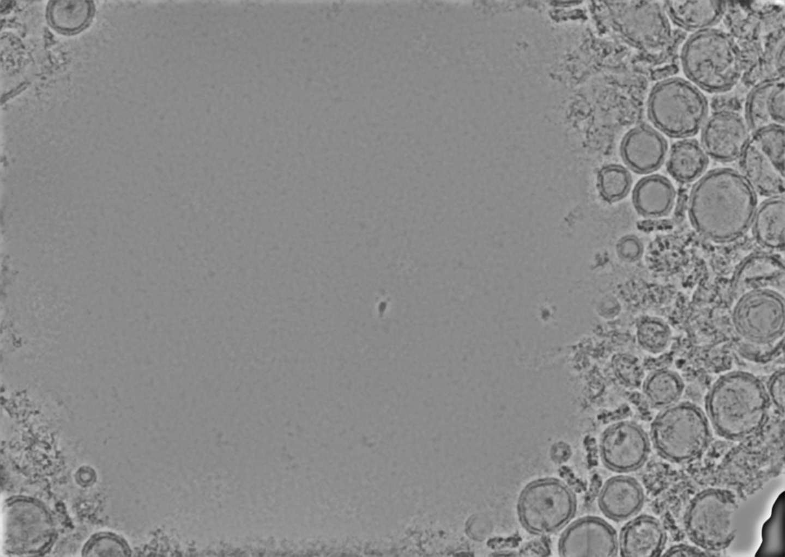

# Consensus Denoise

`consensus_denoise.py` is a [CryoSPARC Tools](https://tools.cryosparc.com/intro.html) script that builds a new CryoSPARC exposure result by taking the pixelwise minimum across the denoised micrographs from multiple matching denoising jobs.

This was motivated by observations described in [this thread](https://discuss.cryosparc.com/t/denoiser-or-patch-motion-should-output-training-mics-as-a-separate-slot/16928/6?u=olibclarke)  - basically that individual CS denoise jobs seem to give stochastic results for individual particles, and taking the consensus seems to mitigate this. It also optionally applies a highpass filter and local contrast enhancement, which helps deal with contrast variation due to ice thickness gradients.

It matches rows by micrograph `uid`, preserves the non-denoised slots from the first source output, and writes new denoised MRC files under the created External job directory.

Script was written with the assistance of the Codex LLM; I have tested it on a few different datasets & machines, but please report bugs if you encounter them.

## Requirements

- Python 3.8+
- `numpy`
- `mrcfile`
- `cryosparc-tools`

Optional features need extra packages:

- `scipy` for `--highpass-mode gaussian_subtract`
- `scikit-image` for `--clahe`
- `matplotlib` for micrograph previews in the log

## Instance Info

By default the script looks for `~/instance_info.json`. You can also pass it explicitly with `--instance-info /path/to/instance_info.json`.

Example format:

```json
{
    "license": "YOUR_LICENSE_ID",
    "email": "user@example.com",
    "password": "YOUR_PASSWORD",
    "base_port": 39000,
    "host": "YOUR_CRYOSPARC_HOST"
}
```

The `license` value can be found in `cryosparc2_master/config.sh`.

## Basic Use

```bash
python3 consensus_denoise.py P3 W2 J101 J102 J103
```

- `P3` is the project UID.
- `W2` is the workspace where the External job will be created.
- `J101 J102 J103` are denoising jobs run on the same micrograph set.
- The first source is the passthrough reference dataset.

If the denoised output lives in a specific exposure group:

```bash
python3 consensus_denoise.py P3 W2 J101:micrographs J102:micrographs J103:micrographs
```

## Common Options

Use a small amount of concurrency for large sets:

```bash
python3 consensus_denoise.py P3 W2 J101 J102 J103 --workers 4
```

Enable a `200 A` pre-consensus high-pass filter:

```bash
python3 consensus_denoise.py P3 W2 J101 J102 J103 --highpass
```

Set a custom high-pass resolution:

```bash
python3 consensus_denoise.py P3 W2 J101 J102 J103 --highpass 300
```

Apply CLAHE after consensus (local contrast enhancement):

```bash
python3 consensus_denoise.py P3 W2 J101 J102 J103 --clahe
```

## Outputs

The script creates a CryoSPARC External job and writes:

- a new exposure output, default name: `micrographs_consensus_denoised`
- new denoised MRC files under the job directory, default subdir: `consensus_denoised_micrographs`

Only the denoised slot is rewritten. Other slots are preserved from the first source output.

Example - (single denoise vs consensus of 5 with highpass & local contrast enhancement):




## Troubleshooting

- If you see a missing dependency error, install the listed package in the same environment where you run the script.
- If `instance_info.json` is missing, pass `--instance-info /path/to/instance_info.json`.
- If source jobs do not share the same micrograph `uid` set, the script will stop.
- If performance is limited by shared storage, try `--workers 1` or `2` instead of higher values.
